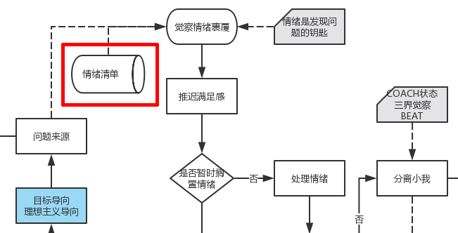

# 易仁永澄的情绪清单

情绪清单是一个帮助解脱情绪绑缚作用的列表文件，是我平时用于自我情绪处理、接访咨询时所用到的专业工具。通过查找情绪清单，可以帮助自己：

1. 更高效地摆脱情绪困扰
2. 更精准地明确问题，找到问题的突破口
3. 更高效地将问题转化为成长的基石

本工具应用于情绪处理流程的起始环节：

核心信念：**任何负面情绪都有正面的积极意义**

## 一、已经完成的情绪清单

1. 焦虑 - Anxious

## 二、工具使用方式

- 请打开网站：[情绪清单](https://runwithcc.gitbooks.io/emotionlist/content/)
- 左侧的情绪中找到自己当下的情绪状态，了解情绪原因和处理方法即可。

## 三、更多服务
如果您的问题没有得到解决，您可以通过以下方式获取更多的付费服务:

- 在行约见易仁永澄：[点击访问](http://www.zaih.com/mentor/84759536/)。平均咨询价格：598元/次
- 申请咨询服务，请联系易仁永澄微信(id:hiddenwangcc)。平均咨询价格：2580元/案例

关于易仁永澄的更多消息，请关注微信公众号：**永澄老师**

## 四、项目团队

- 负责人：易仁永澄
- 成员
    - Auroral
    - 李敏嘉

本项目为开源项目。但任何知识服务都有其价值，如果您认同该价值，请为我们赞助。(使用微信扫描下方二维码支付赞助费)

- - - - 

#### changelog

- 项目日期:2017年02月08日